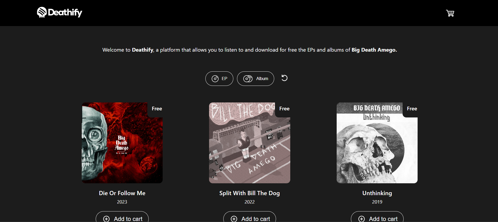
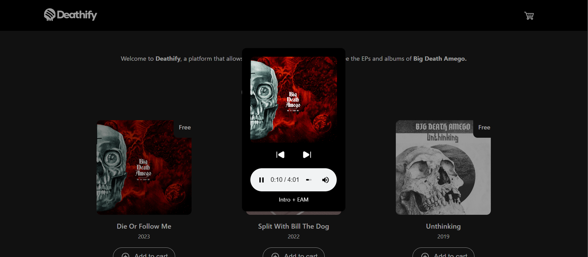
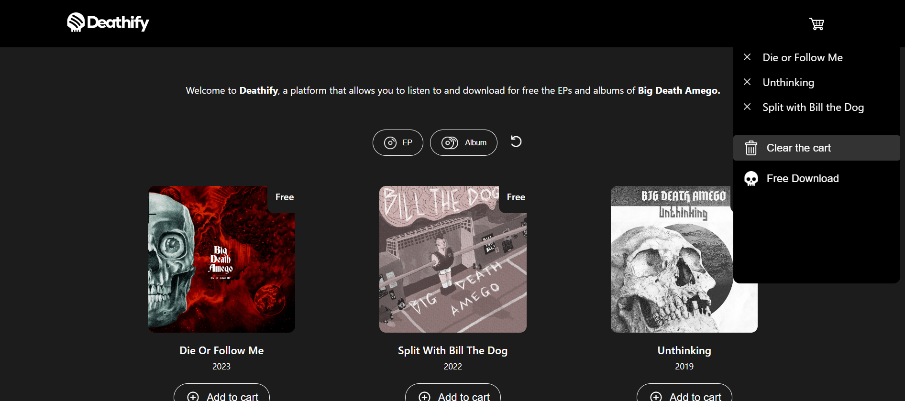
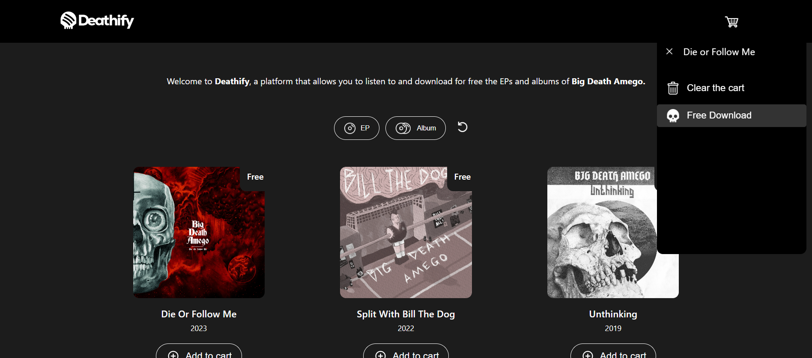
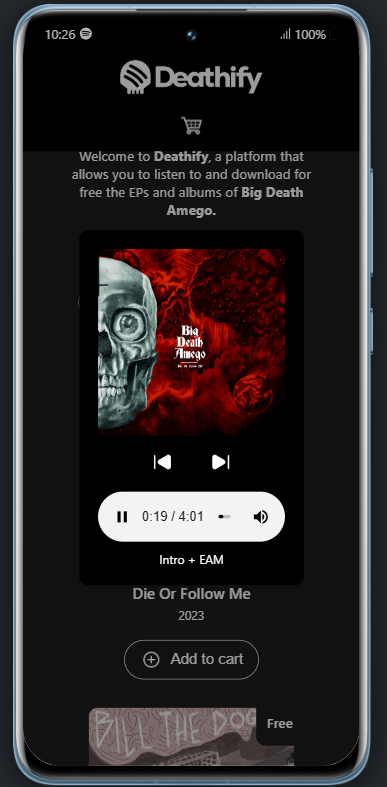

<p align="center">
  
</p>
<br><br>

<p align="center">
  <a href="https://deathify.netlify.app/">🔸 Visit Deathify here 🔸</a>
</p>

<br>
<br>

# 🔸 Deathify - Music Download Platform

Deathify is a frontend application built with React ⚛, designed to allow users to listen to music albums, add them to a cart, and download them for free.<br><br>The aesthetic of the application is heavily inspired by Spotify, making it both visually appealing and user-friendly.<br><br>This platform is adaptable for any music group, but currently, it exclusively features the audio tracks of the band "Big Death Amego".<br><br>It is a simple, responsive application that provides a seamless experience across devices.

## 🔹 Features

<br><br>

- **Music Player**: Listen to albums directly within the application.<br><br>



<br>

- **Shopping Cart**: Add albums to a cart for easy management and download.<br><br>


<br>
<br>

- **Free Downloads**: Download your favorite albums for free.<br><br>



<br><br>

- **Responsive Design**: Ensures a great experience on any device, from desktops to smartphones.
<br><br>


<br><br>

## 🔹 Installation

To run Deathify locally, follow these steps:
<hr><br>

1. **Clone the repository**:
```
git clone https://github.com/your-username/deathify.git
```
```
cd deathify
```
<br>
<hr><br>

2. **Install Node.js and npm**:
- Ensure you have Node.js and npm installed. You can download and install them from <a href="https://nodejs.org/">nodejs.org.</a><br><br>
<hr><br>

3. **Install dependencies**:

```
npm install
```
<br>
<hr>
<br>

4. **Start the development server**:

```
npm start
```
The application will be available at http://localhost:3000.<br>
<br>
<hr>
<br>

5. **Install React (if not already included in the dependencies)**:

```
npm install react react-dom
```
<br>

## 🔹 Contributing
Contributions are welcome! Please feel free to submit a pull request or open an issue to discuss any improvements or features you'd like to see.

## 🔹 License
This project is open-sourced under the MIT License. See the LICENSE file for more information.

## 🔹 Author
Clément DEFER - 2024
